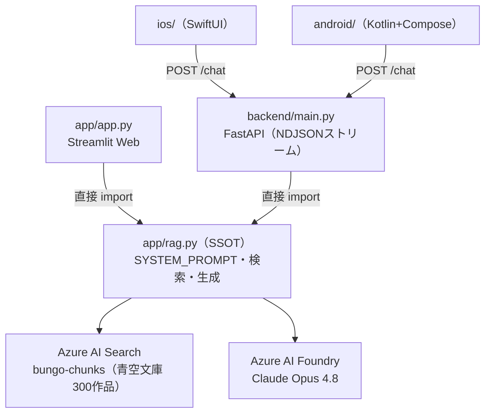

# bungo-rag — 現代語→戦前文体 変換チャットボット

現代日本語を**戦前の文体（旧字旧仮名・文語体）**へ変換する RAG チャットボット。
青空文庫の旧字旧仮名作品を「文体手本」として検索し（内容の転用は禁止）、LLM（Claude Opus 4.8 / Azure AI Foundry）が変換・作文する。

**Web / iOS / Android の3プラットフォームが、単一の RAG ロジック（SSOT: [`app/rag.py`](app/rag.py)）を共有する。**



## ライブ環境

| サービス | URL |
|---|---|
| Web（Streamlit） | https://bungo-app.gentleground-ba3d7ba2.japaneast.azurecontainerapps.io |
| API（モバイル用） | https://bungo-api.gentleground-ba3d7ba2.japaneast.azurecontainerapps.io/health |

どちらも Azure Container Apps（scale-to-zero、**固定費 $0**）。初回アクセスは起動に1〜2分かかることがある。
`/health` の `version` はデプロイ済み SSOT の git SHA を返す。

## リポジトリ構成

```
app/        Streamlit Web UI + RAG コア（rag.py = SSOT。ここを変えると全PFに効く）
backend/    FastAPI — rag.py を import し /chat を NDJSON でストリーム配信（モバイル用）
ios/        SwiftUI ネイティブアプリ（XcodeGen。ios/project.yml からプロジェクト生成）
android/    Kotlin + Jetpack Compose ネイティブアプリ（Gradle）
scripts/    インデックス構築（build_index.py）・CLI検索デバッグ（query.py）
docs/       実機テスト・ロードマップ・品質計画
eval/       （予定）品質評価基盤 — docs/quality-roadmap.md 参照
```

## CI/CD（すべて main への push で自動）

| Workflow | トリガ（paths） | やること |
|---|---|---|
| `deploy.yml` | `app/**` ほか | Web を ghcr → `bungo-app` へデプロイ |
| `deploy-backend.yml` | `backend/*` `app/rag.py` ほか | API を ghcr → `bungo-api` へデプロイ（未作成なら bungo-app から env 複製して自動作成）→ `/health` 疎通ゲート |
| `android-ci.yml` | `android/**` | debug APK ビルド → アーティファクト保存 → main では Releases **`android-latest`** に添付 |
| `ios-ci.yml` | `ios/**` | シミュレータビルド検証 ＋ main では未署名 IPA を Releases **`ios-latest`** に添付 |

**手持ちのスマホでの試し方 → [`docs/device-testing.md`](docs/device-testing.md)**
（Android: Releases から APK を入れるだけ ／ iOS: 自分の Apple ID で署名 — Xcode または Sideloadly）

## 開発を始める

```bash
pip install -r requirements.txt
# .env（gitignore済み）に Azure のキー類を設定 — 詳細は CLAUDE.md「Environment」
streamlit run app/app.py                 # Web をローカル起動（:8501）
uvicorn backend.main:app --reload        # API をローカル起動（:8000）
python scripts/query.py "月の描写"        # 検索と生成を CLI でデバッグ
```

- **開発ガイド（アーキテクチャ・注意点）**: [`CLAUDE.md`](CLAUDE.md)
- **プロジェクト現況・引き継ぎ**: [`STATUS.md`](STATUS.md)
- **生成品質ロードマップ**: [`docs/quality-roadmap.md`](docs/quality-roadmap.md)
- **モバイル対応の設計経緯**: [`docs/roadmap-ios-and-mobile-backend.md`](docs/roadmap-ios-and-mobile-backend.md)
